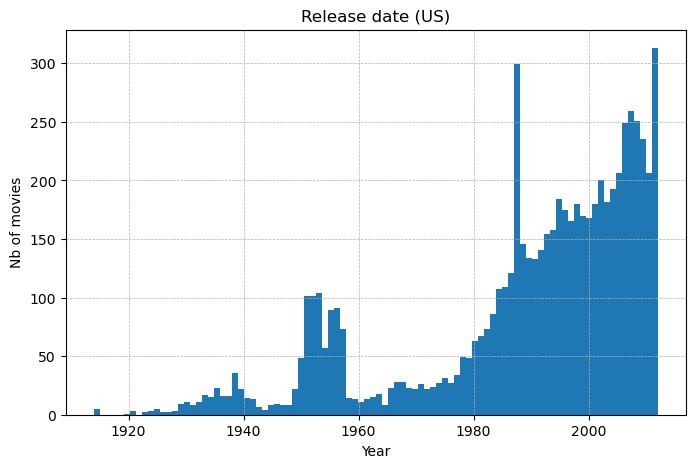
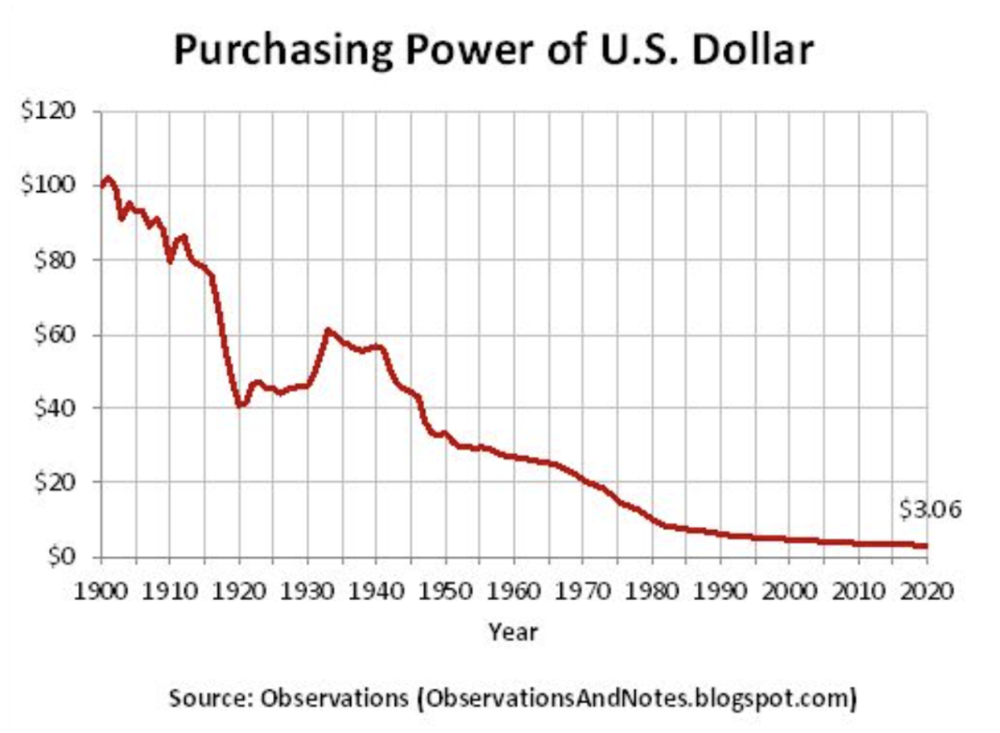

# Will the real pivotal movie please stand up?

## Abstract
Pivotal movie can be characterized as a film that has significantly influenced the industry in the subsequent years of its release, by creating a trend. Such movies might be key representatives in showcasing the diversity and evolution of the cinematic landscape. Moreover, pivotal movies often become important cinematographic references. They might pioneer new techniques in visual effects, storytelling, or character development, which future filmmakers adopt or adapt in their work. They are more than just successful, they are inspirations for change and innovation in the world of cinema. They leave an indelible mark on the industry, influencing generations of filmmakers and shaping the trajectory of films.

The [CMU Movies Summary Corpus](https://www.cs.cmu.edu/~ark/personas/) contains data of 81'741 movies including release date, genres and box-office that are crucial to conduct our analysis.

## Research questions 🔎
Research questions we would like to address during the project:
- Which movies are pivotal in history of cinema?
- How to detect them?
- Can we bring context to explain why they are pivotal?
- In which subsets can we detect pivotal movies, with a trend shape?

## Additional datasets 📈
[Movielens](https://grouplens.org/datasets/movielens/) contains 45'466 movie including budget, box office and reviews, it will allow us to compute more precise metrics.

[MovieStats](https://github.com/danielgrijalva/movie-stats) contains 7'668 movies including budget, box office and reviews, by scrapping IMDb between 1980 and 2010 to complete missing values from our dataset and compute more precise metrics.

We might use more datasets in the future to cover lack of data (particulary box-office and reviews).

## Methods ⚙️

### Step 1: Pre-processing
Pre-processing consist in formatting the data in a way that facilitate further analysis and computations. We will handle missing data and outliers, and normalize the data. We will also enrich the data with additionnal datasets, by merging informations.

We will also filter the dataset, to be more precise on the data covered. We decided to focus on the movies in English and produced by the US. We could introduce more filtering later if needed…

### Step 2: Subsets
There are several ways to create a subset. It has to be relevant enough to analyze a trend. The easier approach is to use genres of movies, but other methods could be interesting to investigate. For example, we could extract vocabulary from a summary (ex: spaceships). Also, our dataset provides us very interesting substance : processed NLP which extracts tropes from summaries (type of character in a movie). Thus, we could analyze occurrences of tropes over time, and possibly draw trends.

We will start by creating simple subsets of genres. Then we will explore other ideas as extra.

We have to be careful when creating subsets to get meaningful results, because a too large one would group movies with not much in common together, and a too small one would group too few movies to draw interesting conclusions.

### Step 3: Shape analysis
We noticed that the number of movies over time has exploded in early 2000's (Fig. 1), then a rough analysis of the distribution wouldn’t be robust. To get more interesting results, we’d like to compare and visualize the evolution of fraction of movies from a specific subset. By plotting this curve, we are seeking an unusual shape, such as a bump or high variation. We typically recognize an unusual shape (of a subset) if it differs from the baseline (whole dataset).

A nice visualization would be a stacked plot to combine both number of releases and fractions of subsets. Here, a problem we might encounter is the high number of genres, because that would require too many colors and overload the graph. An idea to solve this issue is to group genres into 5-10 main categories, and have a more readable plot. For example the genre “airplanes and airport” isn’t that representative yet for a first visualization, however it could be that this category reveals a peak of trend with further analysis…

### Step 4: Range selection of prior movies
Once the unusual shape(s) has been identified, we will select a range prior to the trend peak, assuming the pivotal movie lies inside of it. It is important to choose a proper range so we don't miss the pivotal movie (too short range), and we don't predict a movie without relation (too big range). Recognizing that films influencing a trend wouldn't be released immediately, we acknowledge the time it takes to produce a movie from scratch, typically spanning 2-3 years in 2006 ([1](https://nofilmschool.com/how-long-does-it-take-to-make-a-movie)),([2](https://www.studiobinder.com/blog/how-long-does-it-take-to-make-a-movie/)). Then, the first approach is to select a range of 5 prior years, which seems reasonable. Otherwise, a more precise method that requires more work and hypothesis would be to identify a bump as a roughly (skewed) gaussian curve. Then we could select a range of 1-2 standard deviations prior to the mean/median/mode.

### Step 5: Pivotal Score
Finally, we will elect the most probable pivotal movie of the selected range, which maximizes a score. From our definition of pivotal movie, the score would be based on money generated (which reflects how many people watched the movie) and public advise (how was the movie recieved). The metrics used here would be box-office and review score. Then if several movies reached the top score within a certain threshold, our intuition is to prefer the earliest movie released, because it would be the most likely to influence later releases.

We might investigate further metrics, such as differentiating public and press review score. We’re also thinking of the impact of inflation on the revenue (Fig. 2). It would be interesting to adapt the box-office to the real value of money according to its release year. Then observe if this changes the pivotal movie selected.

### Further steps: ML approach
We’d like to introduce a ML approach to automate the research of pivotal movies. By selecting features that capture the “trend”, with a training set of movies identified as pivotal and not (from the previous approach). Then we’ll fine tune weights to have a robust model, and possibly reveal more pivotal movies. To reduce computations, we could analyze the dataset only by a 10-year tranche.

<p align="center">
  
  &nbsp; &nbsp; &nbsp;
  
</p>

## Proposed timeline ⏳
```
.
├── 27.11.23 – Pre-processing and additionnal datasets
│  
├── 04.12.23 - Creation of subsets, shape analysis and range selections
│  
├── 08.12.23 – Pivotal scores and metrics
│  
├── 11.12.23 – Further investigate
│            ├── Extra subsets
│            ├── Tune range selection
│            ├── Tune metrics
│            ├── ML approach
│    
├── 15.12.23 – Data story
│  
├── 20.12.23 – Final touch
│  
├── 22.12.23 – Milestone 3 deadline
.

```

## Organization within the team 👥
| Team Member | Tasks |
|-------------|-------|
| David       | - Work on criterion to find data similarity between plots. <br> - Find the similarity criteria for both plot and character types for potential pivotal movie subset. <br> - Analyze the results. |
| Manuel     | - Extract data from character clusters. <br> - Creation of potential pivotal movie subset. <br> - Analyze the results. |
| Arthur      | - Find a method to caracterize the success of a movie and method for ranking the most successful movies in a period. <br> - Creation of potential pivotal movie subset. <br> - Analyze the results. |
| Mehdi       | - Find trends in movie history. <br> - Analyze similarity criteria for cross-genre elements. <br> - Rank the pivotal movie subset to identify the most pivotal film. <br> - Create a data story. |
| Paul        | - Find trends in movie history. <br> - Find the similarity criteria for both plot and character types for potential pivotal movie subset. <br> - Create a data story. |

## Questions for TAs 📝
Questions for TAs:
- Do you think the inflation can affect our results?
- Are our metrics reasonable to compute pivotal score? Is there typical techniques to implement a representative score?
- Some movies have a high number of genres, and only a few of them are really relevant. Then they might introduce errors in our predictions, since they impact the distributions shape, plus if they generated a high box-office, they could be predicted as pivotal for a non-relevant genre. How should we handle that then?
